# La machine à voyager dans le temps  

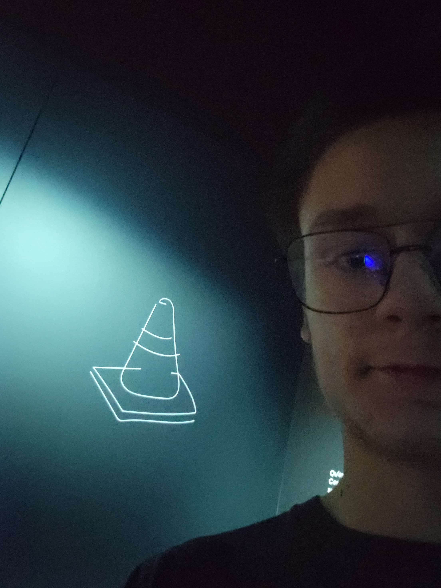

## Une installation phare de l’exposition permanente *MONTRÉAL* au Centre des mémoires montréalaises ou le MEM

**La machine à voyager dans le temps** est l’un des dispositifs phares de l’exposition permanente *MONTRÉAL*, au MEM . À la croisée de l’art, de la technologie et de la muséologie, cette installation immersive propose aux visiteurs un véritable voyage sensoriel à travers les moments clés qui ont façonné l’histoire de la métropole.

### Une immersion dans le passé montréalais

Conçue comme une expérience à la fois ludique, émotive et éducative, *La machine à voyager dans le temps* invite le public à plonger dans différentes époques de l’histoire de Montréal, choisies pour leur portée symbolique et sociale. L’installation permet de revivre :

- **1701 – La Grande Paix de Montréal**, moment historique de diplomatie entre la France coloniale et plus de 30 nations autochtones ;
- **1967 – Expo 67**, vitrine internationale du progrès technologique et de l’ouverture au monde qui a transformé l’image de la ville ;
- **2020 – La pandémie de COVID-19**, période contemporaine encore fraîche dans les mémoires, traitée sous l’angle des vécus citoyens, de la résilience et de la solidarité.

  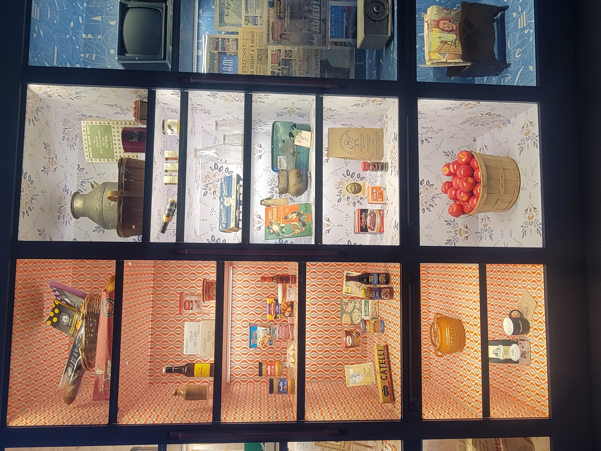
  
---
  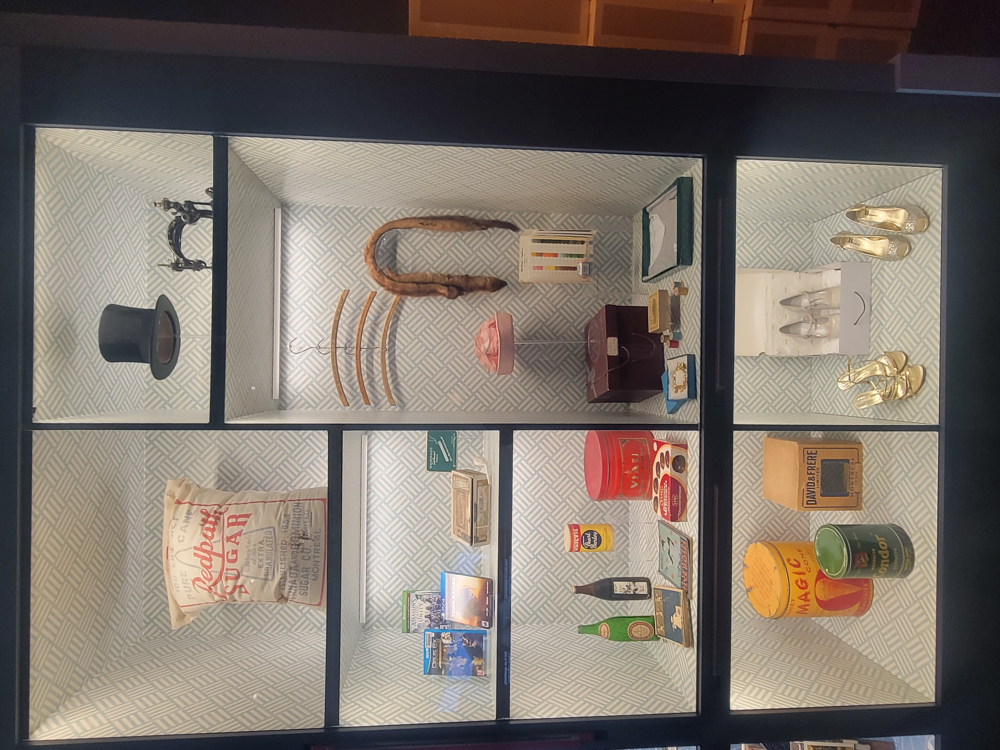
  
---
  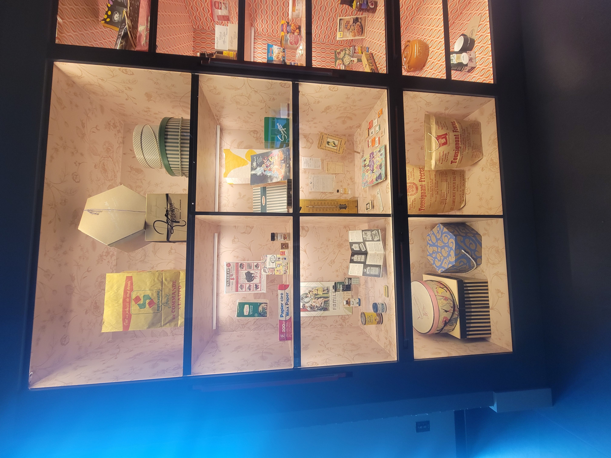
  
---
  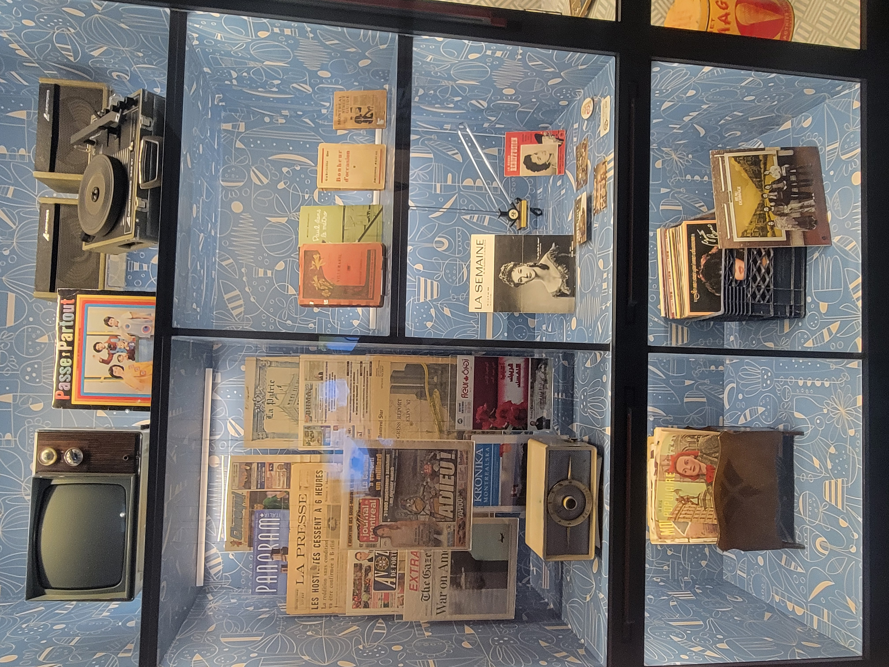
  
---
  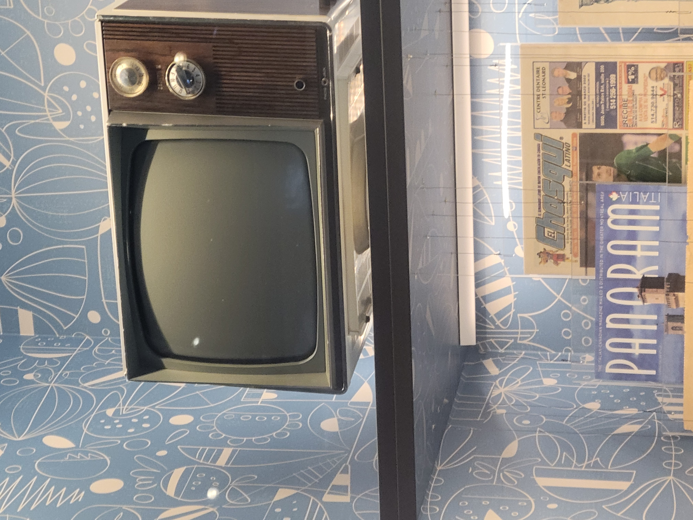

---
À travers ces arrêts temporels, les visiteurs sont plongés dans un environnement multisensoriel combinant projections vidéo, effets sonores immersifs, jeux de lumière, extraits de témoignages oraux et objets d’époque.

### Une narration citoyenne et inclusive

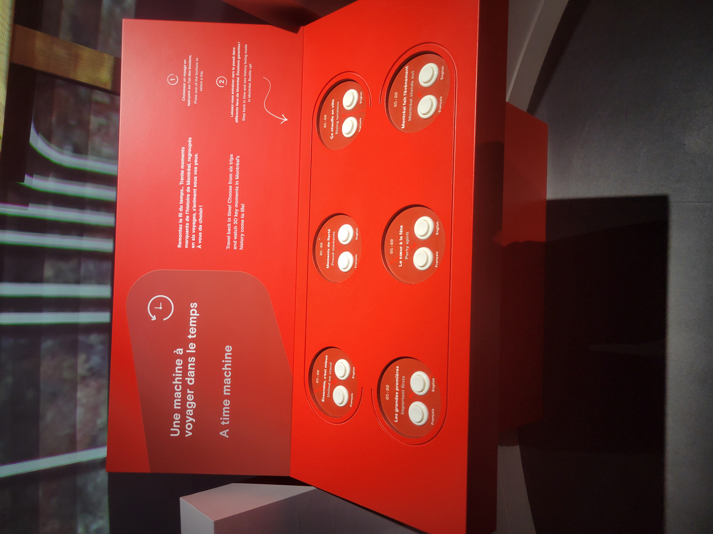

---

Contrairement aux récits historiques souvent centrés sur les grandes figures ou les événements militaires et politiques, le MEM propose ici une lecture résolument citoyenne de l’histoire de Montréal. La machine met en scène la parole de personnes issues de diverses communautés culturelles, sociales et linguistiques. Chaque période historique est racontée à hauteur humaine, à travers des fragments de vie, des souvenirs et des émotions.

---
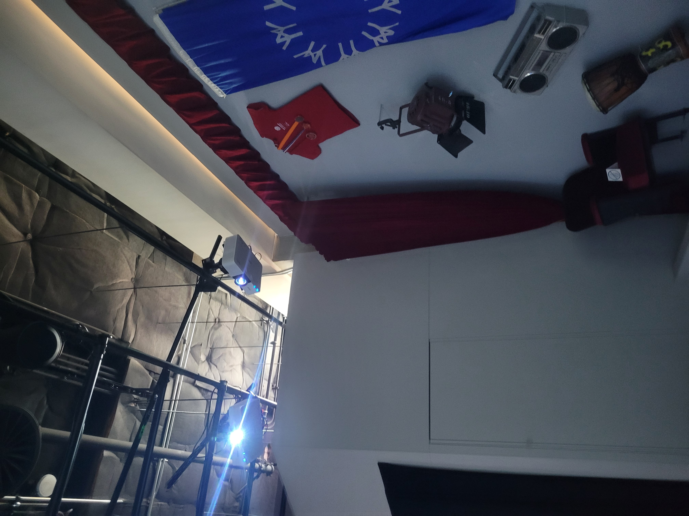
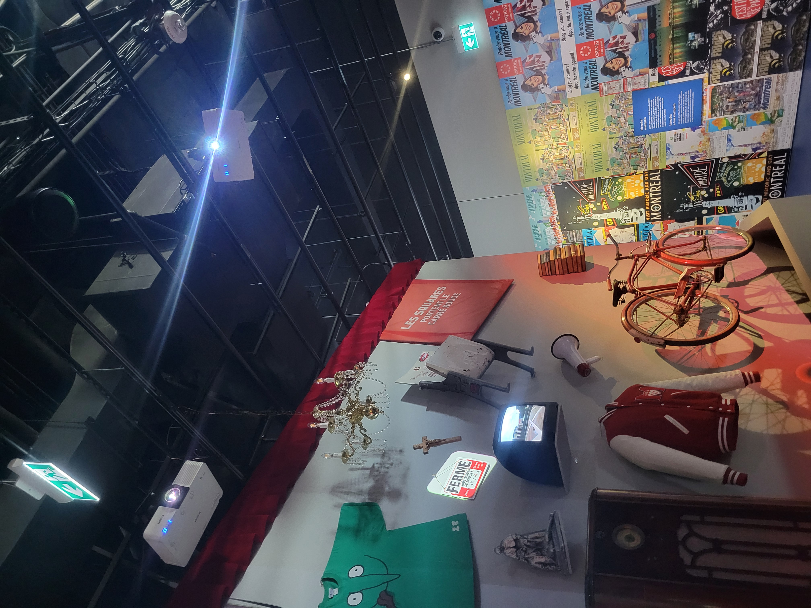
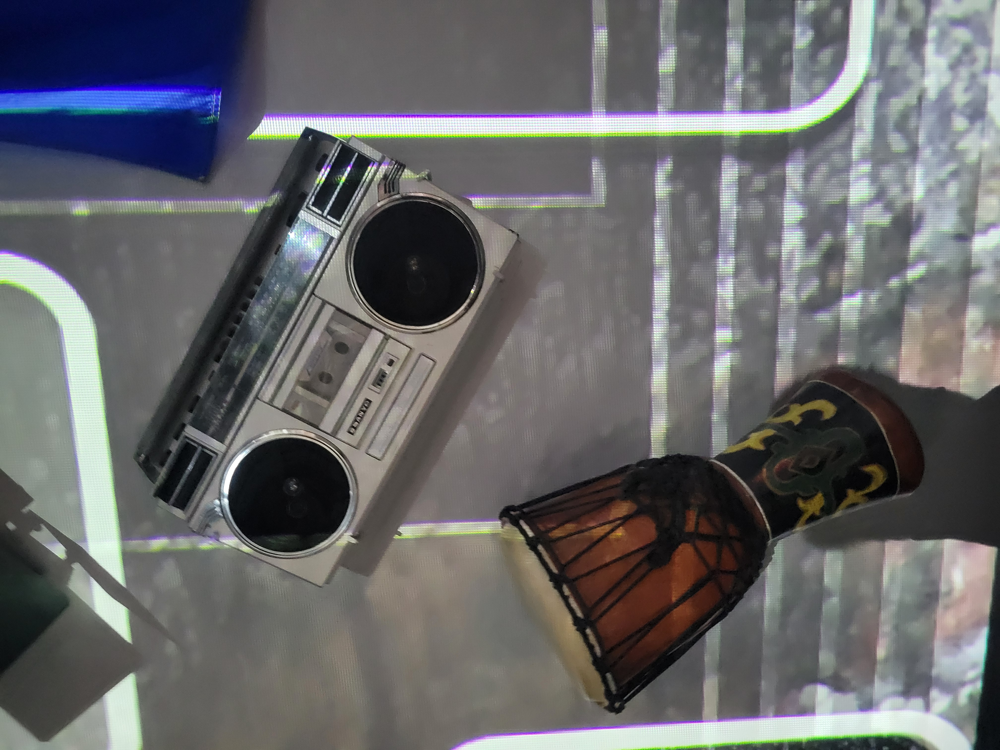
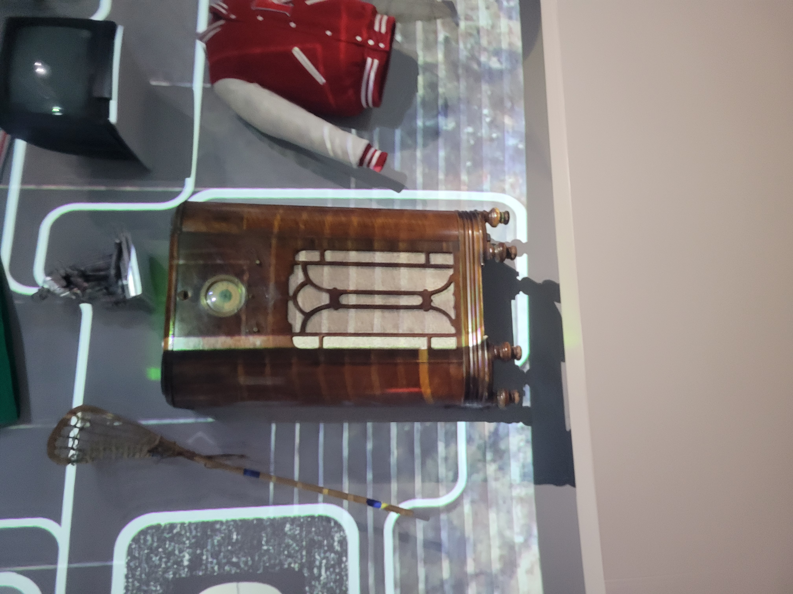

---
Le choix des événements évoqués reflète cette volonté de construire une mémoire collective plurielle. La paix autochtone-française, l’élan moderniste d’Expo 67, ou encore l’isolement vécu lors de la pandémie, sont autant de prismes à travers lesquels Montréal se redéfinit au fil du temps.

---

---

### Une œuvre muséographique audacieuse

La conception de *La machine à voyager dans le temps* repose sur une scénographie innovante, conçue pour brouiller les frontières entre passé et présent. Le visiteur ne regarde pas seulement l’histoire : il y entre. Il devient un témoin actif, parfois même un participant, de scènes recréées avec soin. Ce dispositif incarne l’approche muséologique du MEM, qui repose sur l’émotion, la mémoire vive et le dialogue intergénérationnel.

Des technologies de pointe, comme la projection en haute définition, l’audio immersif directionnel, et une spatialisation scénographique inspirée du théâtre immersif, permettent une restitution sensorielle réaliste et saisissante.

### Une porte ouverte sur la mémoire montréalaise

La machine s’intègre dans une exposition permanente plus large qui explore Montréal sous toutes ses facettes : son urbanisme, ses migrations, ses luttes sociales, ses cultures, son quotidien. À travers des dizaines de récits individuels, des objets personnels, des œuvres d’art, des archives sonores et visuelles, *MONTRÉAL* rend hommage aux femmes, aux hommes et aux communautés qui ont forgé l’âme de la ville.

Au final, *La machine à voyager dans le temps* n’est pas qu’un objet spectaculaire ou un dispositif interactif : c’est une invitation à réfléchir à notre rapport au temps, à l’identité, et à la manière dont l’histoire est vécue, transmise, ressentie.

---

** En résumé :**  
Une installation où la technologie se met au service de la mémoire. Une machine qui ne montre pas seulement l’histoire, mais qui la fait vivre.
