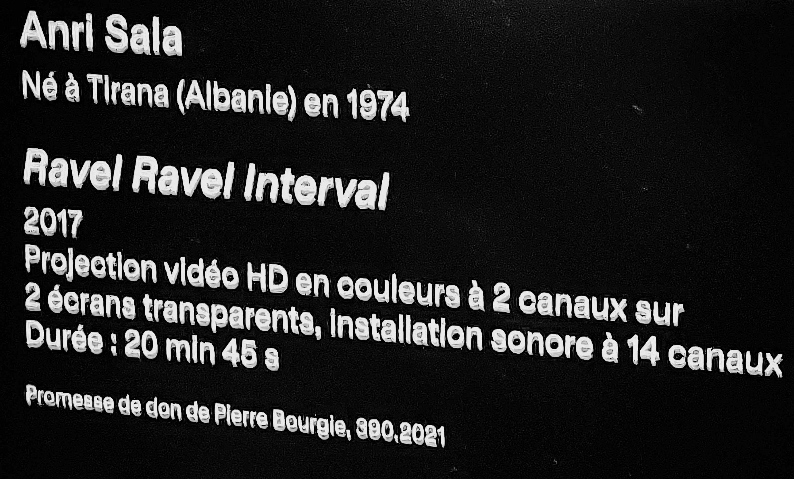
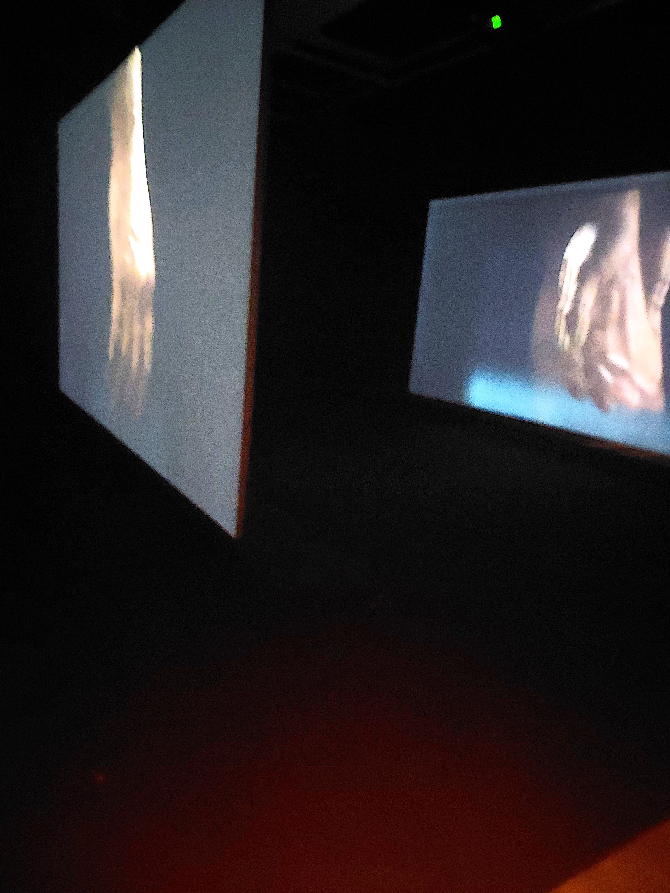
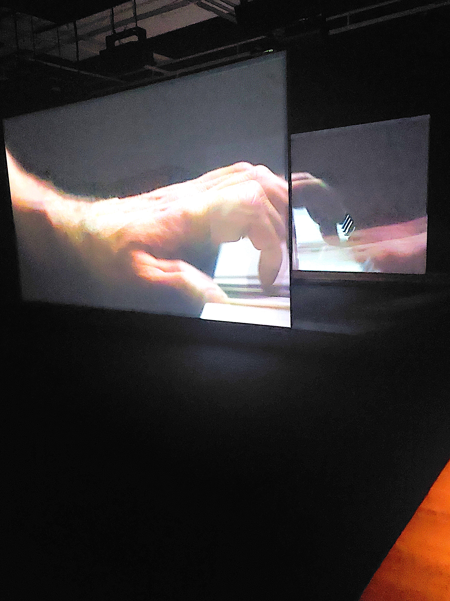

# Présentation de l'œuvre

**Artiste** : Anri Sala  
**Année de création** : 2017  
**Type d'œuvre** : Installation audiovisuelle  
**Lieu d'exposition** : Salle dédiée à l'intérieur du musée

---

## Description de l'expérience

En entrant dans la pièce, le visiteur se retrouve face à deux écrans disposés parallèlement.  
À sa gauche, un banc permet de s’asseoir pour observer l’installation.  
Les écrans, partiellement transparents, laissent apparaître une superposition subtile des deux projections.

Les vidéos diffusent deux enregistrements presque identiques d’une main jouant du piano.  
La séquence, d'une durée de **20 minutes et 45 secondes**, est projetée en boucle.  
Le public est libre d’entrer et sortir à tout moment.

---

## Vue immersive de l'œuvre

L’installation occupe une grande salle isolée.  
Les bancs d’observation sont disposés au fond à droite de la pièce.  
Les 14 haut-parleurs suspendus au plafond produisent une ambiance sonore immersive.  
Les composantes techniques de l’installation – haut-parleurs et écrans – sont clairement visibles, soulignant la mise en scène.

---

## Éléments techniques

-  **2 écrans semi-transparents** en haute définition, diffusant chacun un canal vidéo différent

  
-  **14 haut-parleurs** répartis dans l’espace, chacun diffusant un canal sonore indépendant  

---

## Réflexion personnelle

L’installation m’a semblé quelque peu **monotone**, car elle repose uniquement sur l’image et le son d’un homme jouant du piano, avec une très légère variation vers la fin.  
La durée (près de 21 minutes) paraît excessive compte tenu de la répétitivité, surtout lorsqu’on est obligé de la regarder en entier.

Cependant, j’ai été impressionné par la **qualité sonore** : les 14 canaux créent une ambiance immersive très réussie.  
La **musique**, bien que simple, est agréable et bien intégrée à l’espace.

En revanche, j’ai été déçu par **le contexte de la visite** : seulement deux œuvres étaient présentées ce jour-là, ce qui ne compensait pas l’effort requis pour le déplacement.

---

## Informations supplémentaires

 *Toutes les photographies incluses dans ce compte rendu ont été prises par* **Alexis Guilbault**.

